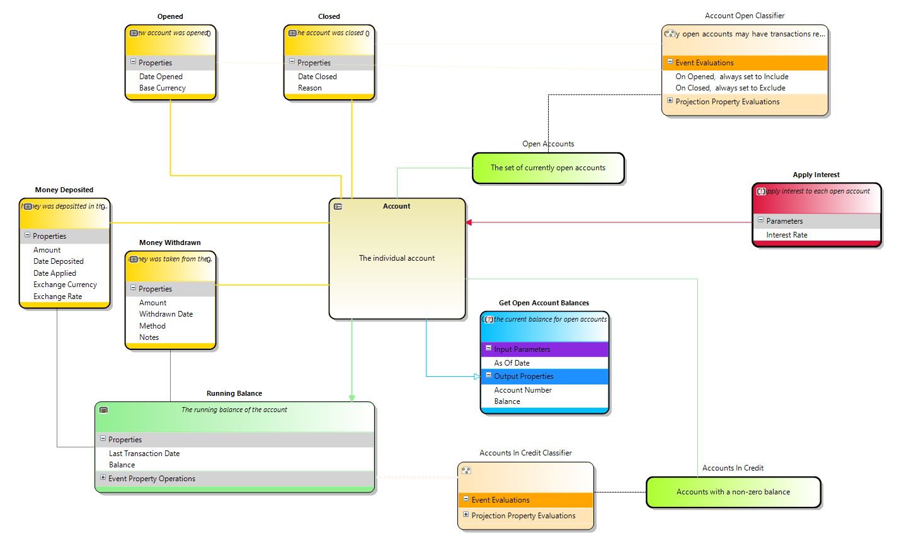

# CQRSDesigner
One of the factors holding back adoption of the Command Query Responsibility Pattern (CQRS) and the related technology of event sourcing (ES) in the .NET community is the lack of tooling to generate and manipulate these models in a way that is familar to users of Entity Framework - that is to say graphically by composition with the resulting model then turned into code.

This Visual Studio plug-in designer is an early attempt to bridge that gap.  It allows you graphically to design domain models consisting of aggregate identifiers, events, projects, commands, queries and identity groups.

The visual model for each aggregate is created by adding the [events](event.md) that can occur, the [projections](projection.md) and [classifiers](classifier.md) that can be run agains these events, the [commands](command.png) that change state in the [aggregate](aggregate.md) and the [queries](query.md) that can be run to get state information out of the system.

## Introduction to CQRS

At its simplest CQRS is an architecture pattern that separates commands (doing) from queries (asking). What this means in practice is that the command and query side do not need to share a common model and this vertical shearing layer is often matched with a vertical shearing layer between the definition (of a command or query) and the implementation (in a command handler or a query handler).

If you have 45 minutes I recommend reviewing [this video](https://youtu.be/kpM5gCLF1Zc) that gives an overview of the architectural pattern along with its strengths and weaknesses.

## Introduction to Event Sourcing

Event sourcing is reversing the existing way of storing data in that instead of storing the current state of objects and updating the state when events occur we store the entire history of events that have occured to an object and use this to derive the current state of the object via [projections](projection.md).

You can find a more detailed explanation in [this article](https://www.codeproject.com/Articles/714742/CQRS-on-Windows-Azure-Event-Sourcing)

## Installing the designer

To intall the CQRS Designer you can install directly from nuget or download the .vsix file from the binaries directory
 

## Further documentation:-
* [Using the designer](designer_howto.md) - a step by step guide on creating CQRS models using the designer
* [The source code](src/readme.md) - overview of how the source code is organised in projects
* [Hosting on Azure](hosting_azure.md) - How to host a CQRS model on Microsoft Azure using serverless functions and event grid

